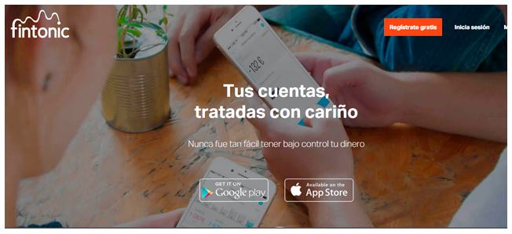
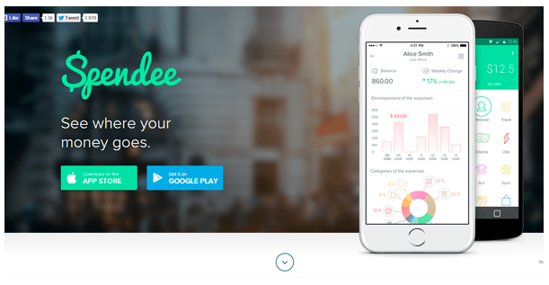
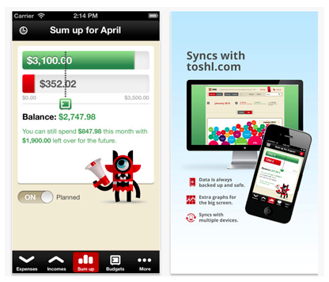
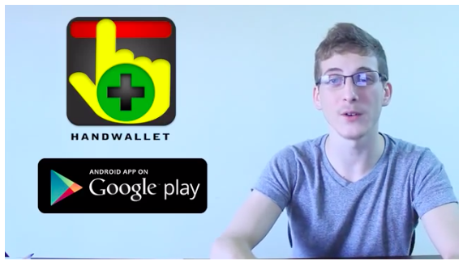

## Salud Financiera Laboratoria

[Presentación del proyecto de Laboratoria](https://github.com/Laboratoria/MEX008-hackathon-Interna-SF)

### Presentación 

Estamos desarrollando una web app diseñada para las estudiantes de Laboratoria. Esta app nos ayudará a construir una cultura de la gestión de nuestras finanzas personales a lo largo del *bootcamp*.

***

### Introducción 

#### Importancia de la gestión saludable de la finanzas

La cultura financiera son las habilidades, conocimientos y prácticas que se poseen y la educación financiera es un proceso de asimilación de información y herramientas que permiten a las personas tomar decisiones en su vida cotidiana. (Gómez, 2014).
Son las habilidades, conocimientos y prácticas que llevamos día a día para lograr una correcta administración de lo que ganamos y gastamos, así como un adecuado manejo de los productos financieros para tener una mejor calidad de vida. (Sánchez, 2014).

Es una realidad que en nuestro país, en general, no contamos con educación ni cultura financieras. Tendemos a borrar el futuro y movernos por las necesidades, emergencias y satisfacciones a corto plazo.

Sin embargo, en algún momento de nuestras vidas necesitamos construir una independencia financiera sostenible y ahí comenzamos a sentir el peso de nuestras carencias en este ámbito.

En este momento se hace indispensable asumir responsablemente la gestión de nuestras finanzas personales. Una gestión saludable de las mismas se basa en construir buenos hábitos y ser constantes. Suena fácil, pero ¿por qué nos cuesta tanto? 

Una planeación financiera es trazar una ruta, reconocer en dónde estamos hoy y hacia dónde y cómo queremos llegar. Es un proceso en el que reconocemos nuestra situación financiera actual, definimos nuestras metas y objetivos, priorizamos los recursos con los que contamos (porque son escasos y finitos) y desarrollamos una estrategia que nos lleve a las metas y objetivos propuestos.

Para trazar este camino se requiere un proceso de autoconocimiento. Reconocer ciertos patrones de conducta en nosotras mismas para entender qué podemos hacer para llevar nuestro plan a cabo. Debemos ser pacientes y saber que los cambios requieren mucha disciplina de nuestra parte y que no se verán de un día para otro. Debemos mantener claro y enfocado qué es lo más importante para nosotras, ya que esto nos permite priorizar y ésta es la clave para un buen manejo de nuestros recursos.

A veces, los pretextos para no asumir responsablemente la gestión de nuestras finanzas es el tener bajos o nulos ingresos. Nada más lejanos a la realidad, ya que mientras más escaso sea el dinero que tenemos y ganamos, más importante será priorizar, cuidarlo y manejarlo bien.

¿Por dónde empezar? Es esencial realizar un presupuesto: un registro de nuestros ingresos y gastos. Esto nos ayudará a mantener el equilibrio de nuestras finanzas y evita que caer en círculos vicioso de vivir al día o endeudamiento.

De acuerdo con un estudio sobre la cultura financiera de los jóvenes en México, sólo el 22% de este sector poblacional lleva un registro de su presupuesto.

Cualquier persona puede ahorrar, aún teniendo un bajo presupuesto, ya sea por tener bajos ingresos o estar viviendo de una reserva de ahorros. La clave para hacerlo es registrar y administrar los gastos, destinar un monto definido para ahorro dentro de nuestro presupuesto y dentro del ahorro, definir categorías, por ejemplo, ahorro para tener un fondo de emergencias, ahorro para una meta concreta a corto plazo y ahorro para metas a futuro.

Para crecer financieramente, nuestros ahorros se pueden incrementar en la medida en que reducimos nuestros gastos (como consecuencia de la planeación) y/o en la medida en que se incrementen nuestros ingresos.

***

### Nuestras usuarias

#### ¿Por dónde empezamos?

Nuestro proceso de diseño comenzó retomando las consignas del proyecto que más llamaron nuestra atención: 

>"...planificar sus ingresos, gastos y ahorros con miras a un futuro tanto de corto como de mediano plazo, y para visualizar la mejor estabilidad financiera que podrá tener en su vida.
...crearás un producto que resuelve el problema de muchas de las estudiantes del Bootcamp de Laboratoria.

>...pocas se han sentado a planificar cómo lograr sus metas financieras y proyectar cuándo lograrlas.

>...no tienen un producto que les guíe a saber lo que les quedará libre del salario ofrecido, ni...a planificar cómo usar ese dinero..."

#### Benchmarking express

Después de leer la presentación del proyecto nos dio curiosidad conocer qué apps de este tipo existen. Así que nos dimos a la tarea de revisar algunas de las apps más populares para la gestión de finanzas personales, retomando [esta lista](https://blog.interdominios.com/10-apps-moviles-para-tus-finanzas-personales/).

Las apps que revisamos fueron:

- **Fintonic**

- **Spendee**

- **Toshl**

- **Gestor de gastos**

Cada una de nosotras descargó una de estas apps en su *smartphone*. Las recorrimos rápidamente reconociendo visualizaciones y funcionalidades para identificar qué nos gustaba, qué no, qué sentíamos que hacía falta desde nuestros perfiles y los objetivos del proyecto.

Tras realizar el reconocimiento y la reflexión, estas fueron las impresiones que compartimos:

Vivi, 22:
>“Quiero tener un registro de los gastos que pago con tarjeta.”  

>“Me gustaría tener categorías de gastos para poder malabarear los diferentes rubros y reajustar mi presupuesto.”

Mariela, 30:
>“La diferencia entre gastar porque tengo mi dinero a la mano, sin contabilizar ni registrar en comparación con comenzar a registrar mis gastos.“  

>“Me gusta que la app Toshl me da etiquetas predeterminadas.”

>“Me gustaría ver gráficas de mis gastos.”
	
Monserrat, 19  
>“Nunca antes he usado una app de finanzas personales”.

>“Acabo de encontrar el app *Gestor de gastos*...Me gusta que hay categorías que yo puedo seleccionar."

Marcela, 28  
>“Usaría un app que sea sencilla e introductoria a las prácticas de finanzas.”

El hecho de que algunas de estas aplicaciones pidan desde el comienzo vincular cuentas bancarias para monitorearlas nos genera desconfianza y resistencia a usarlas.  
Además de sentir que compromete nuestra seguridad bancaria, es también una barrera ya que varias de nosotras no usamos serivicos de banca en línea o no utilizamos nuestras cuentas bancarias en este momento en que no tenemos ingresos.  
Aunque finalmente coincidimos en que estaría bien tener la opción para añadir este tipo de información posteriormente y con ciertas medidas de seguridad.

#### User persona:

El paso anterior nos llevó al siguiente gran paso necesario. Nosotras como estudiantes de Laboratoria en este momento ¿nos sentimos representadas en estas apps? 

Por la duración y los objetivos de este proyecto decidimos acelerar nuestro *research* de usuarixs ya que ¡somos nosotras mismas y nuestras compañeras y amigas de Laboratora <3!

Así que nos dedicamos a crear una primer impresión de nuestro arquetipo de usuaria a partir de lo que actualmente experimentamos y lo que hemos compartido entre compañeras en Laboratoria a lo largo de estos dos meses.

#### Ella es:
 

***

### Nuestra propuesta: Labo Wallet

Identificamos que la mayoría de nosotras estamos viviendo de nuestros ahorros. *Labo Wallet* es una herramienta que nos ayudará a optimizar los recursos que tenemos disponibles para los próximos meses,
 para poder terminar el *bootcamp* sin preocupaciones y sin llegar a crisis financieras.  
*Labo Wallet* nos permite hacer un registro de estos recursos disponibles y de nuestros gastos.  
Tomando consciencia de ellos, se abre la posibilidad de ahorrar para poder sobrellevar estos meses de manera tranquila, contar con una reserva para atender gastos imprevistos e ir gestando una cultura de ahorro y planificación financiera para cuando comencemos a percibir ingresos.

#### Historias de usuarix

Para lograrlo, esta app nos permite:

- Como estudiante de Laboratoria quiero realizar un presupuesto de los próximos meses para poder sobrellevar los gastos que realizaré durante el *bootcamp* y el periodo de contratación.
- Como usuaria quiero ingresar a la web app *Labo Wallet* de manera sencilla.
- Como usuaria quiero crear un perfil personal.
    - Como usuaria quiero editar mi perfil personal para definir mi presupuesto general, mensual y semanal.
- Como usuaria ya registrada, quiero iniciar sesión y visualizar la información registrada previamente.
- Como usuaria quiero visualizar mi presupuesto general, semanal y/o mensual.
- Como usuaria quiero registrar mis gastos e identificarlos por categorías.
- Como usuaria quiero que mi presupuesto se actualice al registrar mis gastos.
- Como usuaria quiero registrar mis ingresos y que se actualice mi presupuesto general.
- Como usuaria quiero visualizar la data sobre los movimientos (gastos e ingresos) que realizo mes por mes para actualizar mi perfil financiero.
- Como usuaria quiero recibir notificaciones:

    - Si estoy alcanzando el límite de mi presupuesto.
    - Si me pasé del presupuesto.

#### Prototipos

https://www.figma.com/file/AV1oIzSA48a5gshtUZrIyZ/Fintech?node-id=0%3A1

