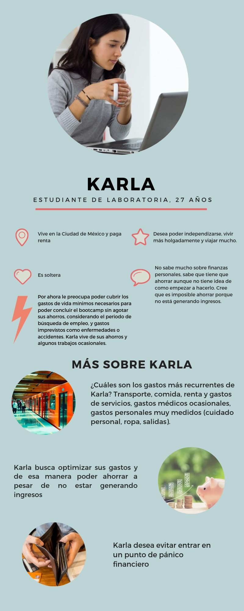

## Salud Financiera Laboratoria

[Presentación del proyecto de Laboratoria](https://github.com/Laboratoria/MEX008-hackathon-Interna-SF)

### Presentación 

Estamos desarrollando una web app diseñada para las estudiantes de Laboratoria. Esta app nos ayudará a construir una cultura de la gestión de nuestras finanzas personales a lo largo del *bootcamp*.

***

### Introducción 
(Pendiente, investigación)

***

### Nuestras usuarias

#### ¿Por dónde empezamos?

Nuestro proceso de diseño comenzó retomando las consignas del proyecto que más llamaron nuestra atención: 

>"...planificar sus ingresos, gastos y ahorros con miras a un futuro tanto de corto como de mediano plazo, y para visualizar la mejor estabilidad financiera que podrá tener en su vida.
...crearás un producto que resuelve el problema de muchas de las estudiantes del Bootcamp de Laboratoria.

>...pocas se han sentado a planificar cómo lograr sus metas financieras y proyectar cuándo lograrlas.

>...no tienen un producto que les guíe a saber lo que les quedará libre del salario ofrecido, ni...a planificar cómo usar ese dinero..."

#### Benchmarking express

Después de leer la presentación del proyecto nos dio curiosidad conocer qué apps de este tipo existen. Así que nos dimos a la tarea de revisar algunas de las apps más populares para la gestión de finanzas personales, retomando [esta lista](https://blog.interdominios.com/10-apps-moviles-para-tus-finanzas-personales/).

Las apps que revisamos fueron:

- **Fintonic**

- **Spendee**

- **Toshl**

- **Gestor de gastos**

Cada una de nosotras descargó una de estas apps en su *smartphone*. Las recorrimos rápidamente reconociendo visualizaciones y funcionalidades para identificar qué nos gustaba, qué no, qué sentíamos que hacía falta desde nuestros perfiles y los objetivos del proyecto.

Tras realizar el reconocimiento y la reflexión, estas fueron las impresiones que compartimos:

Vivi, 22:
>“Quiero tener un registro de los gastos que pago con tarjeta.”  

>“Me gustaría tener categorías de gastos para poder malabarear los diferentes rubros y reajustar mi presupuesto.”

Mariela, 30:
>“La diferencia entre gastar porque tengo mi dinero a la mano, sin contabilizar ni registrar en comparación con comenzar a registrar mis gastos.“  

>“Me gusta que la app Toshl me da etiquetas predeterminadas.”

>“Me gustaría ver gráficas de mis gastos.”
	
Monserrat, 19  
>“Nunca antes he usado una app de finanzas personales”.

>“Acabo de encontrar el app *Gestor de gastos*...Me gusta que hay categorías que yo puedo seleccionar."

Marcela, 28  
>“Usaría un app que sea sencilla e introductoria a las prácticas de finanzas.”

El hecho de que algunas de estas aplicaciones pidan desde el comienzo vincular cuentas bancarias para monitorearlas nos genera desconfianza y resistencia a usarlas.  
Además de sentir que compromete nuestra seguridad bancaria, es también una barrera ya que varias de nosotras no usamos serivicos de banca en línea o no utilizamos nuestras cuentas bancarias en este momento en que no tenemos ingresos.  
Aunque finalmente coincidimos en que estaría bien tener la opción para añadir este tipo de información posteriormente y con ciertas medidas de seguridad.

#### User persona:

El paso anterior nos llevó al siguiente gran paso necesario. Nosotras como estudiantes de Laboratoria en este momento ¿nos sentimos representadas en estas apps? 

Por la duración y los objetivos de este proyecto decidimos acelerar nuestro *research* de usuarixs ya que ¡somos nosotras mismas y nuestras compañeras y amigas de Laboratora <3!

Así que nos dedicamos a crear una primer impresión de nuestro arquetipo de usuaria a partir de lo que actualmente experimentamos y lo que hemos compartido entre compañeras en Laboratoria a lo largo de estos dos meses.

#### Ella es:
 

***

### Nuestra propuesta: [Nombre de nuestra app]

Nuestra propuesta es: "Nombre".  

Identificamos que la mayoría de nosotras estamos viviendo de nuestros ahorros. Esta web app nos ayuda a gestionar nuestros gastos para poder optimizar el presupuesto limitado que tenemos durante el *bootcamp*.  
Al administrar nuestros gastos se abre la posibilidad de ahorrar para poder terminar el *bootcamp* sin preocupaciones y sin llegar a crisis financieras, considerando incluso algunos meses más sin ingresos, durante el periodo de contratación.
Así mismo, queremos mantener una reserva para sentirnos seguras en caso de que surjan gastos imprevistos.

Para lograrlo, esta app:

- Permite crear un perfil de usuaria y almacenar mi información.
- Permite registrar presupuestos y ahorros disponibles.
- Permite registrar ingresos.
- Permite registrar gastos identificados por rubros.
- Permite actualizar mi perfil con los movimientos que realizo mes por mes.
- Permite recibir alertas sobre tu dinero disponible.
- Permite crear y actualizar presupuestos.
  

[Prototipo de baja fidelidad]  

[Prototipo de alta fidelidad]

